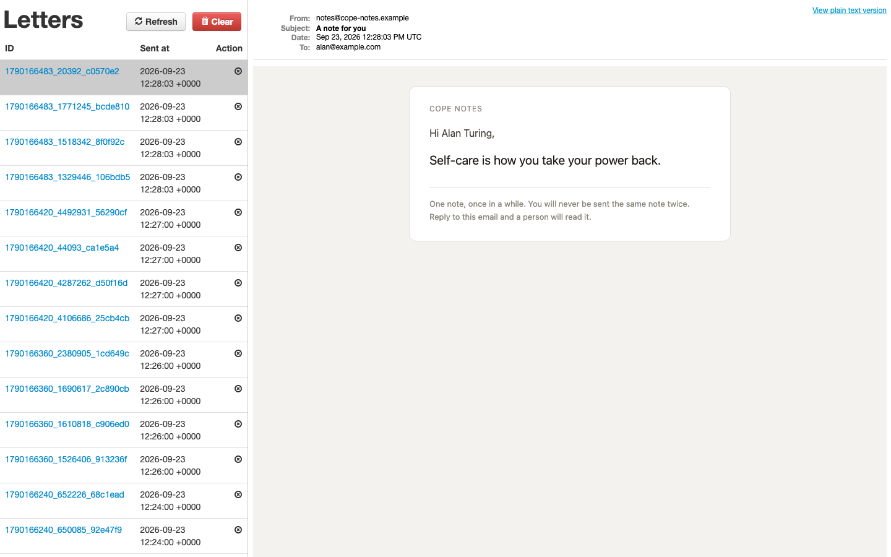
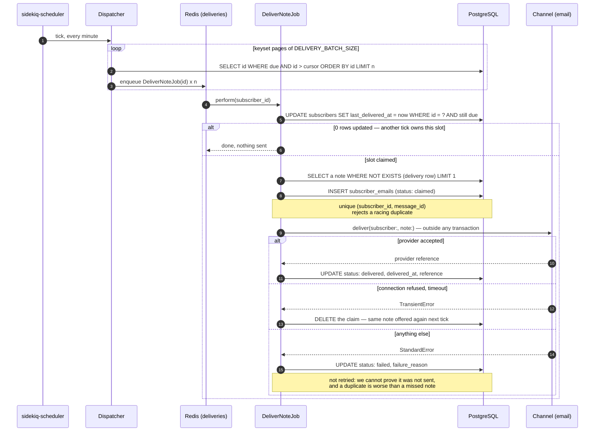
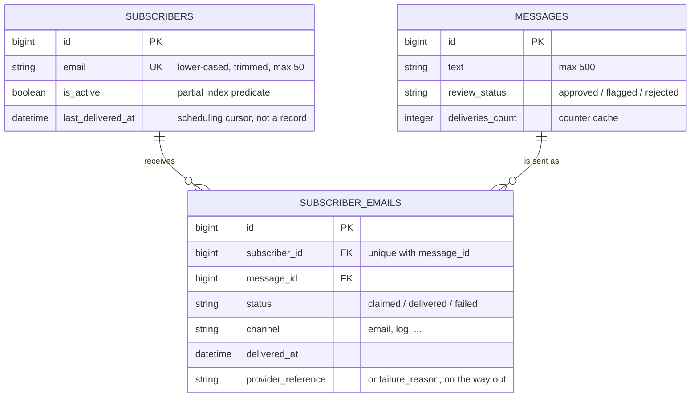

# Cope Notes

A Rails 6.1 JSON API and a Sidekiq worker that email one short supportive note
to each subscriber on a schedule. Notes are written through the API and screened
before they can be sent; once a minute a job works out who is due and fans the
sending out across the worker fleet. There are no application HTML pages: the
product is that pipeline plus the API feeding it.

The hard part is not the emailing. It is the delivery guarantee, and the rest of
this page is how it is enforced and what it costs:

> **No subscriber is ever sent the same note twice, one subscriber's failure
> never touches anybody else's, and what the database says was delivered is what
> was actually delivered.**

## Getting it to actually send

```console
$ docker compose up --build
```

Postgres, Redis, the API on <http://localhost:8191> and the Sidekiq worker; the
web container migrates and seeds on the way up, so ten notes and four
subscribers (three active) are waiting. That stack has been built and booted —
all four containers reported `(healthy)`, `/api/v1/deliveries/stats` returned
live counts, and the cron delivered real mail. Host ports are in
`docker-compose.yml`.

> ### Nothing is emailed unless Sidekiq is running
>
> The schedule lives inside the Sidekiq process (`config/sidekiq.yml`), not in
> Puma. Start only the web process and the API works perfectly, the database
> fills with subscribers, and not one note is ever sent. Compose starts both;
> locally, you start the worker yourself.

Without containers — Ruby 3.0.2 (see `.ruby-version`), PostgreSQL and Redis on
the host:

```console
$ bundle install
$ bin/rails db:setup                            # create, migrate, seed
$ bin/rails s                                   # API on :3000
$ bundle exec sidekiq -C config/sidekiq.yml     # ← the half that sends
```

Give it a minute, then `/letter_opener` shows every note the worker has sent,
`/sidekiq` the queues and the schedule, `/api/v1/deliveries/stats` what the
pipeline thinks it is doing, `/up` a plain `200 ok` for the healthcheck, and
`bin/rails deliveries:tick` runs the dispatcher without waiting for the cron.



Each group in that list is one tick, a minute apart because the seeded
`DELIVERY_INTERVAL_MINUTES` is `1`; set it to `1440` for a note a day. Full
transcripts — boot, worker logs, request/response pairs, the benchmark and the
test run — are in **[docs/captured-output.md](docs/captured-output.md)**.

## One tick, end to end

A tick does no sending of its own. It finds who is due, enqueues one job per
subscriber, and returns; the sends then run across every thread in the fleet, so
a hung SMTP connection delays exactly one subscriber.



Three properties fall out of that ordering. **The send happens outside any
transaction:** the implementation this replaced wrapped the SMTP call in one, so
a connection and a row lock were held for the whole provider round trip, and at
a few hundred subscribers that alone exhausts the connection pool.

**The row is written before the send and confirmed after,** so a row claimed but
never confirmed stays visible in the `claimed` state rather than being
indistinguishable from a success (`SubscriberEmail.unconfirmed` is the alert).
The code path this replaced committed the row and the send together, which is
why the migration introducing `status` backfills every pre-existing row as
`delivered`: back then, a row existing *was* the proof it had been sent.

**Failures are classified, not lumped together:** `Channels::Email` lists the
errors that mean the provider never accepted the note, everything else is
ambiguous by default, and for a product whose notes are interchangeable, losing
one note beats sending a duplicate.

Which note is chosen and how it travels are registry lookups
(`Deliveries::Selectors`, `Deliveries::Channels`) wired in
`config/initializers/deliveries.rb` and picked by env var. Each has two real
implementations — `random_unsent` / `least_delivered` and `email` / `log`, the
last of which is how the benchmark drives the dispatcher without pointing a load
test at an SMTP server.

## What the three tables promise



`index_subscriber_emails_on_subscriber_id_and_message_id` is the exactly-once
mechanism: the claim is a plain `INSERT`, so two workers racing on the same
subscriber cannot both send the same note — the loser's insert is rejected. No
advisory lock, no `SELECT ... FOR UPDATE`, no extra round trip. And
`subscribers.last_delivered_at` is deliberately *not* a delivery record; it is a
rate-limit cursor that moves before the send, while the truth about what was
sent lives in `subscriber_emails`, written after.

The other two indexes are partial: `index_subscribers_due_for_delivery` is
`(last_delivered_at, id) WHERE is_active`, and
`index_subscriber_emails_needing_attention` covers `status <> 'delivered'` —
delivered rows are the overwhelming majority and nothing queries them by status.

## The double-send, found by running it

Firing `deliveries:tick` by hand so that it raced the cron gave every subscriber
two notes inside one minute — the dispatcher's "is this subscriber due?" check
and the job's send were not atomic. The fix is `Subscriber.claim_delivery_slot` —
predicate and write in one conditional `UPDATE`, so Postgres serialises the two
racing statements and the loser matches no rows:

```ruby
due(now, interval).where(id: id).update_all(last_delivered_at: now, updated_at: now) == 1
```

It runs in `DeliverNoteJob`, not in the dispatcher: dispatch and delivery can be
minutes apart under load, so "looked due at enqueue time" is not something the
sender is allowed to trust. Back-to-back ticks now enqueue 4 jobs and then 0
([docs/captured-output.md §6](docs/captured-output.md)).

## Finding the due set: 1,439 ms → 4.1 ms

The job this replaced loaded every note into a hash, walked every active
subscriber with `includes(:messages)`, subtracted one set from the other in
Ruby, and made a blocking SMTP call for each: the work grew with the whole
table, and it was serial. `rails "deliveries:benchmark[10000,200,60]"` measures
the first of those against a real Postgres — 10,000 subscribers, 200 notes,
600,000 existing delivery rows. Wall-clock came off a busy laptop; the ratios
and the allocation counts are the deterministic part.

| | before | after | |
| --- | ---: | ---: | --- |
| Find who is due (one page) | 1,439 ms | **4.1 ms** | ≈350× |
| …objects allocated | 1,330,951 | **1,404** | ≈950× |
| One tick's work for 1,000 subscribers | 1,950 ms | **1,235 ms** | |
| …objects allocated | 1,400,601 | **391,484** | ≈3.6× |
| Choose one subscriber's next note | – | **0.91 ms** | 9 buffer hits |

Three changes produced that:

1. **A partial index covering the due set exactly** — `(last_delivered_at, id)
   WHERE is_active`. Unsubscribed rows are not in the index at all, the
   timestamp gives the range scan, the trailing `id` makes the walk index-only.
2. **Keyset pagination, not `OFFSET`** — `id > cursor ORDER BY id LIMIT n` costs
   the same on page one and page ten thousand, and memory is capped at
   `DELIVERY_BATCH_SIZE` ids however large the table gets.
3. **`NOT EXISTS` instead of set subtraction in Ruby** — planned as a `Hash
   Right Anti Join` off the unique index: 9 shared buffer hits, no heap fetches,
   and nothing about it grows with how many notes that subscriber has already
   received ([plan](docs/captured-output.md)).

### Capacity — reasoned, not measured

Arithmetic on the measurements above plus an assumed 150 ms SMTP round trip.
Nothing below was load-tested against a real provider.

* *Before*: ~152 ms per subscriber, serial, in one job — a once-a-minute
  schedule overruns at roughly **400 subscribers**, then falls further behind.
* *After*: the dispatcher's own work for 10,000 subscribers is ten keyset pages,
  about 41 ms; sending is ~151 ms per subscriber spread across the pool, so
  **≈3,970 subscribers/minute at the default 10 threads, ≈9,900 at 25.** Worker
  containers add to that linearly; the dispatcher does not care.
* *At 1M subscribers* a once-a-minute note is a product problem — ~2,500 threads
  and 16,000 messages/second, which no provider accepts. At a daily cadence the
  due set is ~695 subscribers in any minute, under one keyset page, and about
  **1.8 threads** of sustained sending.

**The thundering herd is real and only partly solved.** A bulk import leaves
every row with `last_delivered_at` NULL, so the next tick finds all of them due
at once and enqueues one job each — a million jobs into Redis in one tick.
`DELIVERY_SPREAD_SECONDS` scatters *execution* over a window, which protects the
provider and flattens the load profile, but the jobs are still all enqueued at
once. A dispatcher that stops at a per-tick cap and resumes from its cursor next
minute is the honest fix, and it is not implemented.

## The API

JSON in, JSON out, **no authentication anywhere** — put this behind a gateway
before exposing it. Parameter wrapping is on, so a body may be flat
(`{"text": "…"}`) or nested (`{"message": {"text": "…"}}`).

| Method | Path | Notes |
| --- | --- | --- |
| `GET` | `/api/v1/messages` | every note with its recipients; `?review_status=flagged` filters |
| `POST` | `/api/v1/messages` | `{"text": "…"}` → `201` with the screening verdict, or `422` |
| `PATCH` / `DELETE` | `/api/v1/messages/:id` | re-screened if the text changed; `204` on delete |
| `GET` | `/api/v1/subscribers` | each with the notes they have received |
| `POST` | `/api/v1/subscribers` | `{"email": "…", "name": "…"}`; addresses are lower-cased and trimmed before the uniqueness check |
| `PATCH` | `/api/v1/subscribers/:id` | **toggles** `is_active` — the body is ignored |
| `DELETE` | `/api/v1/subscribers/:id` | also deletes that subscriber's delivery rows |
| `GET` | `/api/v1/deliveries/stats` | aggregate-only snapshot: counts, live channel, strategy, interval |

`text` is 500 characters, `name` and `email` 50 each; `GET /:id` returns `200`
or `404`. A Postman collection for the CRUD endpoints is in `postman/`.

**Screening runs on every write**, because these notes reach people who are
having a hard time. The offline `HeuristicReviewer` catches only what is
unambiguous in plain text; `AnthropicReviewer` asks Claude, and runs only when
`ANTHROPIC_API_KEY` is set. Screening **fails open** — a reviewer that raises
falls back to the offline one, then to approving — because blocking an editor
because a third-party API is rate-limited is worse. `rejected` notes are
excluded from selection for good; `flagged` ones are still deliverable, an
editor's queue rather than a block.

## Settings

Everything environment-specific is read from the environment; no secret is
committed. `MAILER_FROM_ADDRESS`, `DATABASE_*`, `REDIS_URL`, `RAILS_MAX_THREADS`,
`PORT` and `HEALTHCHECK_URL` do what their names say — `config/database.yml` and
`docker-compose.yml` show the defaults. The ones that change behaviour:

| Variable | Default | What it does |
| --- | --- | --- |
| `DELIVERY_INTERVAL_MINUTES` | `1` | minimum gap between two notes to one subscriber; `1440` is a note a day |
| `DELIVERY_BATCH_SIZE` | `1000` | subscriber ids per keyset page — the dispatcher's memory ceiling |
| `DELIVERY_SPREAD_SECONDS` | `0` | scatter a tick's jobs over this many seconds instead of enqueuing them at once |
| `DELIVERY_CHANNEL` | `email` | which channel sends; `log` writes to the Rails log instead |
| `NOTE_SELECTION_STRATEGY` | `random_unsent` | `least_delivered` favours newly written notes |
| `SIDEKIQ_CONCURRENCY` | `10` | worker threads per Sidekiq process |
| `ANTHROPIC_API_KEY` | unset | enables model-based screening; unset, the offline reviewer is used |
| `SIDEKIQ_WEB_USERNAME` / `SIDEKIQ_WEB_PASSWORD` | unset | when **both** are set, `/sidekiq` sits behind HTTP basic auth |

## Tests and lint

`bin/rails db:test:prepare && bundle exec rspec` → **143 examples, 0 failures**,
with no network call in any of them: the Anthropic reviewer's specs stub
`Net::HTTP` outright, and with no API key configured the screener never reaches
for it. RuboCop runs from its own bundle (`bin/lint`, `bin/lint -A`), so lint
tooling never enters the application's dependency graph and a RuboCop upgrade
can never move a runtime gem.

If you go looking for the sent mail: `letter_opener_web` is mounted **only** in
development, and compose's `web` and `worker` share a volume at
`tmp/letter_opener` because the worker sends while the web process serves the
viewer. Without it the viewer stays empty, which looks exactly like "nothing is
being sent".

## Known gaps

* **No authentication.** Any caller can create, edit and delete notes and
  subscribers; `/sidekiq` is behind basic auth only if you set both credentials.
* **No unsubscribe link in the email.** `PATCH /api/v1/subscribers/:id` toggles
  the flag, but nothing in the note lets a recipient act on it. For a product
  that emails people unprompted this is the first thing to fix, and a legal
  requirement in most jurisdictions.
* **Note and subscriber listings are unpaginated** and eager-load the join both
  ways — fine for an editorial tool over a few hundred notes, not past that.
* **A subscriber who has received every note simply stops**, silently; delivery
  rows grow at subscribers × notes with nothing archiving them.
* **An ambiguous send failure loses that note for that subscriber permanently.**
  The deliberate trade — no duplicates — but a provider outage returning 500s
  quietly burns one note per affected subscriber. The rows are visible as
  `status: failed`; nothing reconciles them.
* **Webpacker, Turbolinks, Sass, Action Cable, `spring` and `whenever` are
  generator leftovers** the API never uses; pruning them is a dependency change.
